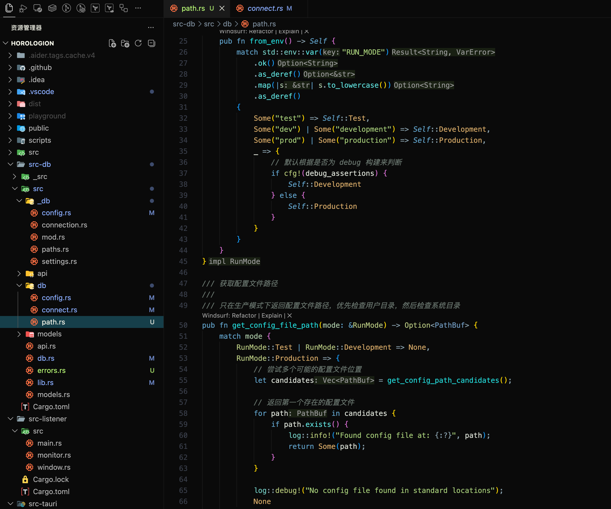

# Dark-Arui

**Black enough**

Dark-Arui 是一款专为长时间编码设计的暗色主题,采用统一的深黑背景和低对比度设计,营造出沉浸式的开发体验。以绿色和青色为主的语法高亮既柔和又显眼,让代码阅读更加舒适。



## 🎨 颜色方案

### 主色调

- **背景色**: `#0a0a0a` - 深邃黑
- **文本色**: `#e0e0e0` - 柔和浅灰

### 语法高亮

- **字符串**: `#7fb069` - 柔和绿
- **关键字**: `#5dbcd2` - 青
- **函数**: `#52b788` - 亮绿
- **数字/常量**: `#d4a574` - 柔和黄
- **类型/类**: `#6db3d4` - 柔和蓝
- **注释**: `#6b7d7d` - 灰青,平衡可见度

### 状态颜色

- **错误**: `#d46a6a` - 柔和红
- **警告**: `#d4a574` - 黄橙
- **信息**: `#6db3d4` - 蓝

## 📦 安装

### 从 VS Code Marketplace 安装(暂无)

1. 打开 VS Code
2. 按 `Cmd+Shift+X` (macOS) 或 `Ctrl+Shift+X` (Windows/Linux) 打开扩展面板
3. 搜索 "Dark-Arui"
4. 点击安装

### 手动安装

#### 获取插件

可以通过两种方式获取 `.vsix` 文件进行插件的安装。

##### 直接下载

直接通过 `github` 的 [`release`](https://github.com/Feudalman/dark-arui/releases) 页面下载合适的版本到本地。

##### 手动构建

1. 通过 `npm install -g vsce` 安装 `vsce`。
2. 克隆该项目,并在根目录执行构建 `vsce package`
3. 构建后应在根目录生成 `dark-arui-0.0.1.vsix` 文件

#### 手动安装-1

1. 打开 VS Code
2. 按 `Cmd+Shift+P` (macOS) 或 `Ctrl+Shift+P` (Windows/Linux)
3. 输入 "Extensions: Install from VSIX..."
4. 选择目标 `.vsix` 文件

#### 手动安装-2

1. 检查是否已有 `code` 命令(用于管理 vscode)：`code --version`
2. 若不存在则打开 `vscode` 并通过快捷键打开扩展面板：

- macOS：`Cmd+Shift+X`
- Windows/Linux：`Ctrl+Shift+X`

3. 在扩展面板中执行：`Shell Command: Install 'code' command in PATH`,再次检查是否存在 `code` 命令
4. 通过 `code` 将 `.vsix` 安装为插件：`code --install-extension dark-arui-0.0.1.vsix`

## 🚀 使用

1. 安装主题后,按 `Cmd+K Cmd+T` (macOS) 或 `Ctrl+K Ctrl+T` (Windows/Linux)
2. 在列表中选择 "Dark-Arui"

或者通过设置：

```json
{
  "workbench.colorTheme": "Dark-Arui"
}
```

## 🤝 反馈与贡献

如果你有任何建议或发现问题,欢迎：

- 提交 Issue
- 创建 Pull Request
- 分享你的使用体验

**Enjoy coding in the dark!** 🌙

## 📄 License

Copyright 2024-2025 Emotion Machine (Beijing) Technology Co., Ltd.

Licensed under the Apache License, Version 2.0 (the "License");
you may not use this file except in compliance with the License.
You may obtain a copy of the License at

    http://www.apache.org/licenses/LICENSE-2.0

Unless required by applicable law or agreed to in writing, software
distributed under the License is distributed on an "AS IS" BASIS,
WITHOUT WARRANTIES OR CONDITIONS OF ANY KIND, either express or implied.
See the License for the specific language governing permissions and
limitations under the License.
